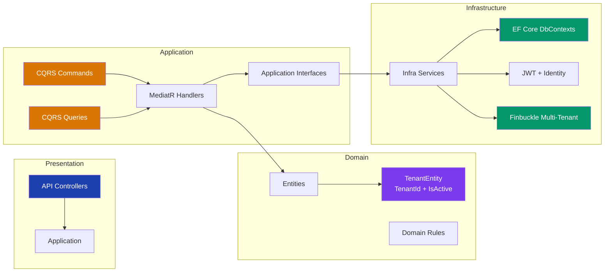
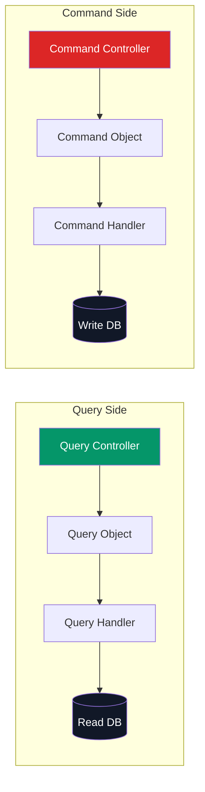
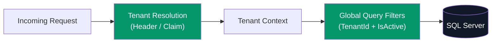
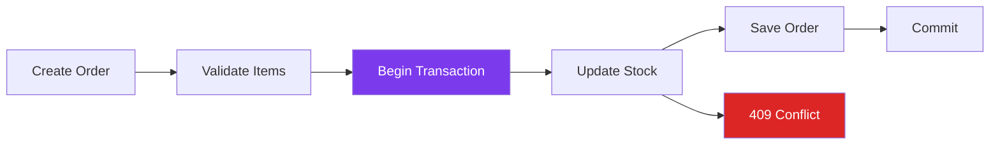
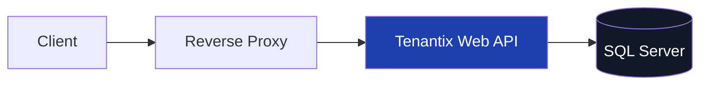

# Tenantix Platform

A **multi-tenant SaaS backend** built with **.NET** and **SQL Server**, structured using **Clean Architecture** and **CQRS (MediatR)**.

Tenantix focuses on two things:
1) **Strict tenant isolation** (no cross-tenant data access)  
2) **Production-style authorization** (permissions + policies + handlers), with safe order/stock operations.

---

## 🚀 Live Demo

[](https://tenantix-api.onrender.com/healthz)
[](https://tenantix-api.onrender.com/swagger/index.html#/Tenants/Tenants_CreateTenant)
[](https://render.com)

> Most endpoints require `Authorization: Bearer <JWT>` and a `tenant` header — see [API Usage](#-api-usage).
---
> **Core model**  
> - **Platform Tenant**: manages the tenant lifecycle (create/activate/deactivate/upgrade).  
> - **Store Tenant**: owns tenant-scoped business modules (Products, Categories, Customers, Orders, Carts).  
>  
> All business data is tenant-scoped through the tenant context + EF Core filtering (TenantId + IsActive).

---

## ✨ What this project demonstrates

### ✅ Multi-tenancy (Finbuckle.MultiTenant)
- Tenant can be resolved from:
  - **JWT claim** (`tenant`)
  - **HTTP header** (`tenant`)
- Tenant metadata is stored in an EF Core store and used to build the request tenant context.

### ✅ Tenant Isolation (Data Safety)
- Business entities follow a tenant-scoped base model (TenantId).
- Soft-delete style behavior is implemented using `IsActive`.
- EF Core global query filters ensure:
  - inactive records are not returned by default
  - tenant boundaries remain consistent across queries

### ✅ Authentication & Authorization (Permissions-first)
- JWT contains claims needed for authorization and tenancy:
  - `tenant`, `tenant_type`, `roles`, `permissions`
- Endpoints are protected with `[ShouldHavePermission]`
- Authorization is resolved via:
  - dynamic policy provider
  - permission handler (checks `permissions` claims)
  - tenant type handler (platform-only vs store-only endpoints)

### ✅ Orders & Stock correctness
- Order creation runs in an explicit DB transaction to avoid partial writes.
- Stock checks are applied before commit.
- Concurrency is handled using SQL Server **rowversion** (optimistic concurrency).
- Concurrency conflicts should be surfaced as `409 Conflict`.

---

## 🧩 Architecture Documentation

> Mermaid diagrams render directly in GitHub README.

---

## 1️⃣ High-Level Design (HLD) — System Context

```mermaid
graph LR
    Client["Client Apps<br/>Web / Mobile"] --> Gateway["API Gateway / Reverse Proxy"] --> WebAPI["Tenantix Web API"]

    subgraph Core["Application Core"]
      App["Application Layer<br/>CQRS + Services"] --> Domain["Domain Layer<br/>Entities + Rules"]
    end

    subgraph Infra["Infrastructure"]
      Identity["Identity + JWT"]
      Tenancy["Multi-Tenancy Engine"]
      SQL[("SQL Server")]
    end

    WebAPI --> App
    App --> Identity
    App --> Tenancy
    App --> SQL

    style Client fill:#1e40af,color:#fff
    style WebAPI fill:#1e40af,color:#fff
    style App fill:#059669,color:#fff
    style Domain fill:#7c3aed,color:#fff
    style SQL fill:#111827,color:#fff
````

---

## 2️⃣ HLD — Multi-Tenant Request Flow

```mermaid
sequenceDiagram
    autonumber
    participant Client
    participant API as Web API
    participant TM as Tenant Middleware
    participant TS as Tenant Store
    participant Db as ApplicationDbContext
    participant SQL as SQL Server

    Client->>API: HTTP Request + tenant header OR tenant claim
    API->>TM: Resolve tenant
    TM->>TS: Load tenant metadata
    TS-->>TM: TenantInfo
    TM-->>Db: Set Tenant Context
    Db->>SQL: Query with Tenant Filter + Global Filters
    SQL-->>Db: Tenant-scoped data
    Db-->>API: Result
    API-->>Client: Response
```

---

## 3️⃣ Low-Level Design (LLD) — Clean Architecture



---

## 4️⃣ CQRS Pattern — Command vs Query



---

## 5️⃣ Security & Authorization Flow (JWT → Roles → Permissions → Policies)

```mermaid
graph LR
    subgraph Identity["Identity & Authentication"]
        User["User"] --> JWT["JWT Token"] --> Claims["Claims<br/>tenant / tenant_type / roles / permissions"]
    end

    subgraph RBAC["RBAC (Role-Based Access Control)"]
        Roles["Roles"]
        RolePerm["Role ↔ Permission Mapping"]
        Permissions["Permissions"]
    end

    subgraph Authorization["Authorization Pipeline"]
        Attribute["ShouldHavePermission"]
        PolicyProvider["Policy Provider"]
        AuthHandler["Authorization Handler"]
    end

    Claims --> Roles --> RolePerm --> Permissions
    Permissions --> Attribute --> PolicyProvider --> AuthHandler

    style JWT fill:#1e40af,color:#fff
    style Roles fill:#059669,color:#fff
    style Permissions fill:#059669,color:#fff
    style Attribute fill:#d97706,color:#fff
    style PolicyProvider fill:#d97706,color:#fff
    style AuthHandler fill:#d97706,color:#fff
```



---

## 6️⃣ Tenant Isolation & Data Protection (Tenant Context + Global Filters)



---

## 7️⃣ Orders & Stock Consistency (Transaction + Concurrency)



---

## 8️⃣ Runtime Topology



---

## 🛠️ Getting Started (Local)

### Prerequisites

* .NET SDK 8+
* SQL Server (LocalDB / SQLExpress / Full)
* Optional: Docker

### Run Locally

```bash
dotnet restore
dotnet build
dotnet run --project "Tenantix Platform/Tenantix.WebApi.csproj"
```

---

## 🔐 API Usage

Most endpoints require:

* `Authorization: Bearer <JWT>`
* `tenant: <tenant_identifier>`

Tenant resolution:

* HTTP header `tenant`
* or JWT claim `tenant`

---

## 🧠 Interview Talking Points (Quick)

* Tenant isolation is enforced at the **database query level** (tenant context + global filters)
* Authorization is **permission-driven** using policies + handlers
* Roles are a grouping mechanism, but access decisions are **permissions-based**
* Orders use an explicit **transaction** to guarantee atomic writes
* Concurrency is handled with SQL Server **rowversion** (optimistic concurrency)
* Controllers stay thin; business rules live in services/handlers

---

## 🧭 Roadmap (CV-Focused Completion)

* Checkout: Cart → Order (idempotent)
* Order lifecycle states (Confirmed / Packed / Shipped / Delivered)
* Integration tests (tenant isolation + concurrency + invalid transition)
* Audit fields + soft delete enhancements (CreatedAt/By, UpdatedAt/By)

---

## ⚖️ License & Intellectual Property

### Copyright

© 2026 **Khaled Abd Elhanan**. All rights reserved.

### License (MIT)

Permission is hereby granted, free of charge, to any person obtaining a copy of this software and associated documentation files (the "Software"), to deal in the Software without restriction, including without limitation the rights to use, copy, modify, merge, publish, distribute, sublicense, and/or sell copies of the Software.

The above copyright notice and this permission notice shall be included in all copies or substantial portions of the Software.

THE SOFTWARE IS PROVIDED "AS IS", WITHOUT WARRANTY OF ANY KIND.

---

## 👨‍💻 Author

**Khaled Abd Elhanan**
📧 `khaldbdalhnan383@gmail.com`


